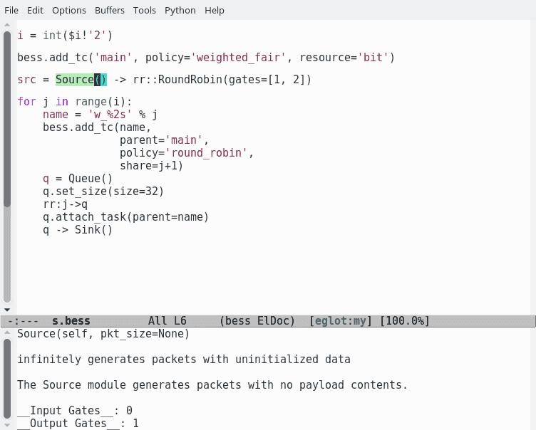
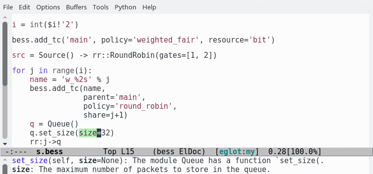
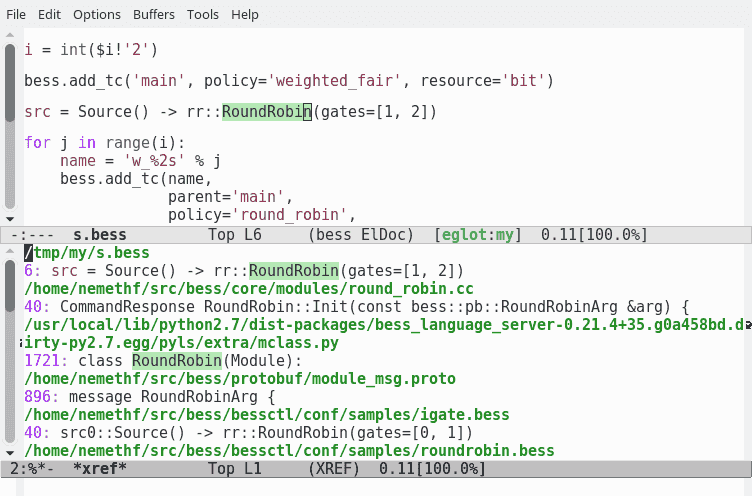
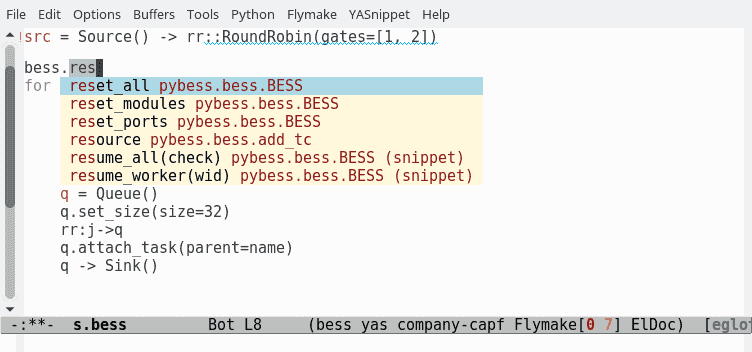
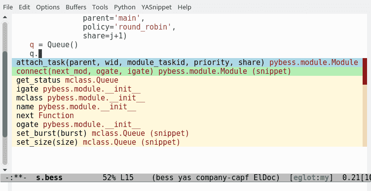

Bess Language Server
====================


bessls is a simple modification of
[pyls](https://github.com/palantir/python-language-server).  See the
original [README](README.orig.rst).

The [Bess](https://github.com/NetSys/bess) scripting/configuration
language is basically python with some syntactic sugar and global
variables.  bessls relies on
[bess-gen-doc](https://github.com/nemethf/bess-gen-doc) for the global
variables (see [mclass.py](bessls/extra/mclass.py)).  It uses very
simple heuristics to understand the syntactic sugar.

The BESS environment variable should be set to path of the bess source
code.

bessls should work with any text editor supporting the [language
server protocol](https://langserver.org/), however I only tested it
with emacs/[eglot](https://github.com/joaotavora/eglot).

## Features

* Documentation help of a bess module

  

* Documentation help for a method arugment

  

* Jump to definition / refereces.  In case of multiple references, the
  default order of the references is "project", "cpp_definition",
  "mclass", "protobuf", "examples".

  

* Completion of the global variable `bess`

  

* Completion of a module instance

  

## Installation

Install with `python setup.py install`.
The [original README](README.orig.rst#installation) has more details.

## Configuration of bessls

bessls adds additional configuration variables to the [original
ones](README.orig.rst#configuration).  `bess.definitions` and
`bess.refereneces` defines a lists of reference types.  The server
searches for definitions/references considering the lists in order.
The possible reference types are `project`, `cpp_definition`,
`mclass`, `protobuf`, and `examples`.

The bess-specific configuration variables can be append to an existing
setup.cfg, tox.ini, or pycodestyle.cfg file; or it can be placed in a
separate .bessls file.  With the following example, bessls searches
the current project (workspace) and then the module_msg.proto file for
references.

```
[bess]
references = project, protobuf
```

## Configuration of Emacs/eglot

Adding the following lines to the [Emacs initialization
file](https://www.gnu.org/software/emacs/manual/html_node/emacs/Init-File.html)
is enough.  However, there are further configuration ideas in
[bess.el](bess.el).

```elisp
(setenv "BESS" "/opt/bess")

(define-derived-mode bess-mode python-mode "bess")
(add-to-list 'auto-mode-alist '("\\.bess\\'" . bess-mode))
(with-eval-after-load 'eglot
  (add-to-list 'eglot-server-programs
               '(bess-mode . ("bessls"))))
```
